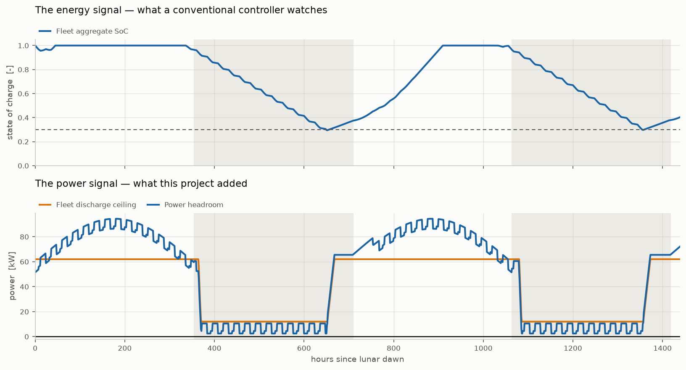
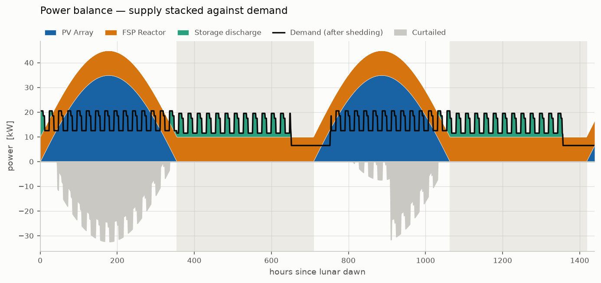
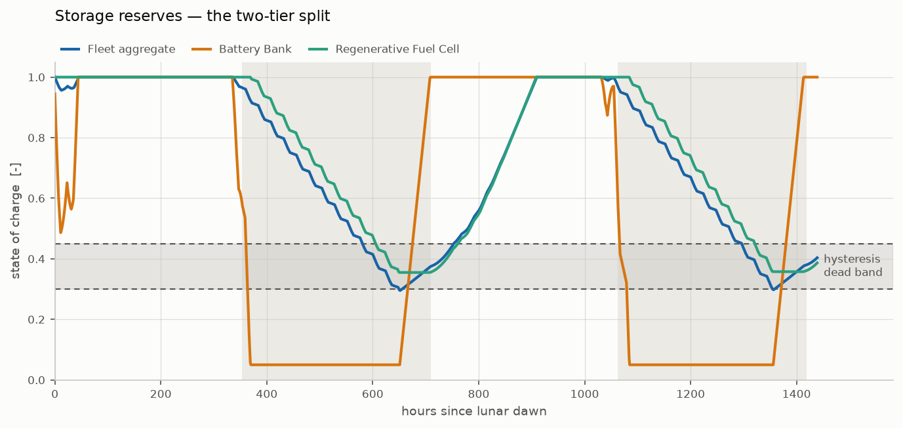
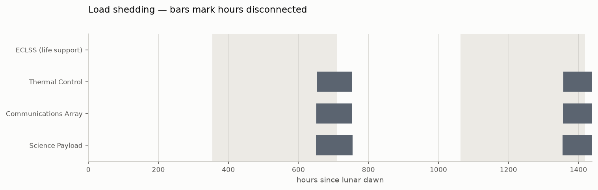

# Lunar Microgrid Simulation

An hour-by-hour simulation of the power system for an autonomous lunar outpost:
a photovoltaic array, a fission reactor, a battery, a regenerative fuel cell,
four loads, and a controller that decides what to switch off when the reserves
run low.

It runs 60 days — just over two full lunar cycles — and answers one question
that a single number cannot: **when this outpost fails, does it fail because it
ran out of energy, or because it ran out of power?**

---

## The result

A conventional microgrid controller watches one signal: state of charge. Run a
reactor outage through this model in deep lunar night and that signal reports
everything is fine while the outpost is already browning out.

```
FAILURE MODE — why the bad hours were bad
  energy-limited                     0.0 h   (reserve below 0.30)
  power-limited                      1.0 h   (100% of shortfall hours)
  worst power-limited SoC         0.6159   <- reserve looked this healthy
                                              while the bus was failing
```

**Every hour of unserved power happened at a fleet reserve of 0.62.** Not near
empty — comfortably above the 0.30 shed threshold, and rising.

The mechanism is the two-tier storage. The battery is efficient and fast
(50 kW, round trip 0.9025) but shallow; it empties about 36 hours into a
354-hour night and then sits at its floor for the rest of it. The fuel cell is
deep but slow — 2090 kWh of deliverable energy behind a **12 kW** stack. So the
fleet can hold plenty of energy and still be unable to deliver it fast enough:

<picture>
  <source media="(prefers-color-scheme: dark)" srcset="docs/figures/two_signals_dark.png">
  
</picture>

Top panel: the signal a conventional controller watches. Bottom: the one this
project adds. The red line is unserved power. It lands where the top panel
looks healthy and the bottom panel has crossed zero.

The fix is two signals rather than one — a capacity-weighted energy aggregate
**and** a measured power headroom — with the controller acting on whichever
fires first.

---

## Quick start

Python 3.11 or newer.

```bash
git clone <this repo>
cd lunar_microgrid_sim

python3 -m venv .venv
.venv/bin/pip install -r requirements.txt

.venv/bin/python main.py
```

That prints an eight-line summary of a nominal 60-day run. The interesting one
is the contingency:

```bash
.venv/bin/python main.py --outage 500 --report
```

| Flag | Effect |
|---|---|
| *(none)* | nominal run, summary only |
| `--outage HOURS` | scripted 24 h reactor outage starting at that hour |
| `--report` | the full KPI report — reliability, failure mode, storage duty, dawn margins |
| `--figures` | render four figures, light and dark, into `data/figures/` |
| `--topology` | model feeder resistance and conductor loss |
| `--converters` | model power-electronics efficiency per asset |
| `--export` | write the 1440-row history as CSV and JSON |

Everything together:

```bash
.venv/bin/python main.py --outage 500 --report --figures --export
```

> The **first** `--figures` run is slow while matplotlib builds its font cache —
> once, then never again. Without that flag matplotlib is never imported, so a
> numbers-only run does not pay for a plotting library.

### Tests

```bash
.venv/bin/python -m pytest tests/ -q        # 300 tests, ~2.5 s
.venv/bin/python tests/mutation_check.py    # reintroduces 9 real bugs, ~2 min
```

---

## How it works

The simulation is a loop over 1440 one-hour ticks. Every tick does the same
five things, in this order:

```
1. MEASURE     aggregate_soc, the fleet's discharge ceiling, generation,
               and demand as the loads currently stand.
                   headroom_w = generation + ceiling - demand
2. DECIDE      the controller sheds or restores AT MOST ONE load
3. RE-MEASURE  demand, because step 2 may have changed it
4. DISPATCH    surplus into storage, or a deficit out of it, in merit order
5. RECORD      one flat dict describing everything that happened
```

Two details in that order matter more than they look.

**The controller runs before dispatch, on signals measured at the start of the
tick.** That is what a real sampled control loop does — and what the
microcontroller this is eventually meant to run on would do. Letting the
controller see the result of the dispatch it is deciding about would be a
forecast of its own interval, which IEEE 2030.7 excludes from core control
functions.

**Nothing is remembered between ticks.** An earlier design passed the
controller a shortfall measured at the *end* of the previous tick, and it
chattered: a successful shed zeroes the shortfall, so the restore branch read
the cure as the absence of the disease and undid the shed one tick later. The
signal is now signed and current — negative headroom is the shortfall, positive
headroom is the margin a load must fit inside before it can come back.

### Who talks to whom

```
main.py            the ONLY module that names a concrete class.
  │                build_outpost() is the parts list.
  ├── environment.py     how much sun is there at time t?
  ├── assets/
  │     base_asset.py    PowerSource · PowerStorage · Load  (interfaces)
  │     generation.py    PVArray · FissionSurfacePower
  │     storage.py       BatteryBank · RegenerativeFuelCell
  │     loads.py         ECLSS · ThermalControl · CommsArray · SciencePayload
  ├── controller.py      ControlStrategy (interface) · AutonomousController
  ├── power_bus.py       one tick: measure, decide, dispatch, record
  └── simulation_engine.py   the loop around it, plus CSV/JSON export

metrics.py         what the history MEANS   — pure functions over a list of dicts
visualization.py   what it LOOKS like        — same
```

`power_bus.py` and `simulation_engine.py` import **no concrete asset and use no
`isinstance()` check**. Adding a second reactor or a flywheel is a constructor
argument in `main.py`; the engine does not change. `metrics.py` and
`visualization.py` never touch a simulation object at all — they read an
exported history, so any figure can be redrawn months later from a CSV.

### The control policy

Three branches, tried in order:

| # | Fires when | Dwell timer | Why |
|---|---|---|---|
| 1 | `headroom_w < 0` | **bypassed** | the bus is already failing; an uncontrolled brownout drops loads in whatever order physics picks |
| 2 | `aggregate_soc < 0.30` | enforced | reserves draining, supply still meets demand |
| 3 | `aggregate_soc > 0.45` **and** the load fits in `headroom_w` | enforced | both signals must agree before anything comes back |

One action per tick — a staircase, not a cliff, so the outpost sheds only as
much as it actually needs. Loads are shed least-important-first and restored
most-important-first. **ECLSS is never shed**, under any combination of
signals: losing life support to save the bus is not a trade this controller may
make. If a deficit outlives every sheddable load, the correct behaviour is to
report unserved power and let the record show it.

The gap between the 0.30 and 0.45 thresholds is a hysteresis dead band. Were
they equal, the outpost would shed at 0.2999, recover to 0.3001, restore, drop
again, and oscillate every hour for the rest of the night. Contactors have
finite switching lifetimes.

---

## What is modelled

<picture>
  <source media="(prefers-color-scheme: dark)" srcset="docs/figures/power_balance_dark.png">
  
</picture>

| | Value | Note |
|---|---|---|
| Lunar cycle | **708.7 h** synodic | 354.35 h day, 354.35 h night |
| PV array | 100 m², 30 % triple-junction, 34.9 kW peak | sine of solar elevation, ×0.95 dust derate |
| Reactor | 10 kWe, optional scripted outage | NASA Kilopower/FSP class |
| Battery | 200 kWh, 50 kW, round trip 0.9025 | 180.5 kWh deliverable |
| Fuel cell | 120 kg H₂, 12 kW out / 25 kW in, round trip 0.385 | 2090 kWh deliverable |
| Loads | 20.5 kW peak, 15.7 kW mean | ECLSS, thermal, comms, science |

The lunar cycle figure is worth dwelling on. The familiar "14 Earth days" gives
336 h, which is the Moon's *rotation* period halved. A power system does not
care about rotation — it cares when the Sun comes back, which is the **synodic**
period of 29.53 days. The shorthand understates the night by 5.1 %, and NASA's
Fission Surface Power requirement is written against the real figure:
*"capability for at least 354 hr of nighttime energy storage."*

<picture>
  <source media="(prefers-color-scheme: dark)" srcset="docs/figures/reserves_dark.png">
  
</picture>

The two-tier split, visible: the battery (orange) crashes to its floor within
about 36 hours of nightfall and stays there; the fuel cell (green) carries the
remaining ~318 hours.

---

## Two results that were not the point but are worth reporting

**27 % of everything generated is thrown away.** 8254 kWh curtailed over 60
days, because the fuel cell cannot absorb the daylight surplus fast enough
(25 kW electrolyser against a 32 kW peak surplus, with tanks that fill). That
is a sizing finding, not a bug.

**Removing two flattering assumptions cost less than expected.** Switching the
PV from a square wave to a sine profile and adding a dust derate cut daily solar
*energy* by 38 %. The energy balance still closes with zero unserved — the
reserve margin merely narrows from 0.241 to 0.174. Daylight surplus was never
the binding constraint.

---

## Declared simplifications

Stated rather than left to be discovered:

- **No thermal model.** Radiator sizing, regolith conductivity and the cold
  soak on hardware through the night are all out of scope.
- **No degradation.** Cells do not fade, catalysts do not poison, and the dust
  derate is a fixed factor standing in for a process that genuinely worsens
  over mission life.
- **No electrical topology.** This is a power balance, not a load flow: no bus
  voltage, no currents, no converter efficiencies distinct from device
  efficiencies. A single-line diagram would document intended architecture, not
  something the model computes.
- **Equatorial site assumed** by default. `PV_SUN_TRACKING` selects the polar /
  Vertical Solar Array regime instead, where the sun stays near the horizon and
  a square wave is closer to correct than a sine.
- **The restore fit test asks what a load draws *now*.** A duty-cycled load can
  be restored during its idle window and bite when it switches on. Testing peak
  demand would need the `Load` interface to publish a nameplate maximum;
  testing next hour would be forecasting. Exposure is one timestep.

A full audit against NASA and IEEE sources — six findings, all closed — is in
[`docs/compliance_inspection.html`](docs/compliance_inspection.html).

---

## Roadmap

The simplifications above are not a permanent boundary — they are the order of
work. Each item below exists because the one after it cannot be honest without
it.

### Next: electrical topology

Give the model a bus voltage and per-feeder currents, converter ratings
distinct from device efficiencies, and enough of a protection scheme to say
what each breaker is actually rated for.

This is the step that turns a power balance into something buildable. It is
also what would make a single-line diagram *real* rather than illustrative — an
SLD is properly a statement about voltage levels and protection, not just about
what connects to what. Every downstream ambition needs it first.

### Next: the model running client-side

Port the simulation core to JavaScript so it runs in a browser rather than
replaying an exported history.

Most of the work is already done by accident of an earlier constraint: the
controller is plain arithmetic with no numpy, written that way so it would port
to a microcontroller. The same discipline makes it port to JS almost line for
line, and the environment, storage and load models are equally small. It is a
translation, not a rewrite.

### Then: an operable single-line diagram

Not a replay — a diagram you can *operate*. Change the array size, move the
outage, open a breaker by hand, and watch the grid respond, because the model
is running underneath rather than being played back.

### Eventually: a hardware render

A physical representation of the outpost that reflects the specified system
rather than an artist's impression. This needs the topology work above: you
cannot render hardware you have not specified.

### Open regardless

- **The controller has never run on a microcontroller.** It was written to
  port — single decision function, plain arithmetic, no dependencies — but the
  target board is unchosen and the claim is untested. An ESP32-class part is
  assumed plausible, not confirmed.
- **Curtailment is 27 % and unaddressed.** The obvious lever is a larger
  electrolyser; whether the mass penalty is worth it is a real trade study
  nobody has run.
- **The restore fit test looks only at present demand**, so a duty-cycled load
  can be restored during its idle window. Publishing a nameplate maximum on the
  `Load` interface would close it without resorting to forecasting.

---

## The wire is not free

`--topology` adds the electrical layout: a 120 VDC user bus carrying every
asset, and the reactor a kilometre away behind a 1000 V link, with every feeder
sized to a 5 % loss budget. It changes the answer.

| Nominal 60-day run | Power balance | `--topology` | `--converters` | both |
|---|---|---|---|---|
| served | 20898.5 kWh | 20463.3 kWh | 19646.5 kWh | 19293.6 kWh |
| **unserved** | **0.0 kWh** | **10.3 kWh** | **142.1 kWh** | **155.5 kWh** |
| curtailed | 8254.5 kWh | 6048.6 kWh | 6459.2 kWh | 4275.5 kWh |
| conductor loss | — | 2587.9 kWh | — | 2518.1 kWh |
| converter loss | — | — | 2959.7 kWh | 2952.3 kWh |
| total lost | — | 8.56 % | 9.79 % | **18.10 %** |

**The outpost that never failed now fails, with no outage at all.** Ten
kilowatt-hours is not much, but it is the difference between a system that
meets its load and one that does not, and it was invisible while the model had
no conductors in it.

**And the silicon costs more than the copper.** Converters alone lose 9.79 %
against the conductors' 8.56 %, and cost **fourteen times** the unserved
energy — 142.1 kWh against 10.3. Copper is visible, gets drawn on diagrams and
attracts the attention; the power electronics are a box on a wall and cost
more. Nothing in the device efficiencies already covered them: `PV_EFFICIENCY`
is a cell figure, the battery's 0.95 is electrochemical, and the fuel cell's
0.55 is stack chemistry producing a low unregulated voltage that needs the
largest converter in the outpost.

Together they lose **18.1 % of everything generated**.

Three more things fall out.

**The cable is worst when the Sun is up.** A conductor on the regolith runs
near 400 K in daylight and 100 K at night — a 6.28× swing in resistance. Losses
are **10.36 % of generation in daylight against 2.69 % at night**, as a
fraction, so this is not merely that more power flows by day. A feeder sized at
the reference temperature loses about 7.1 % at noon against its 5 % budget.

**Per-feeder budgets do not compose.** Eight feeders each sized to 5 % do not
give a 5 % system; they give 8.56 %. The budget belongs to the outpost, not to
each run, and sizing feeder by feeder quietly spends it eight times.

**Distance is not the cost — voltage is.** Where the copper actually goes:

```
PV Array                                        883.8 kWh    50 m at  120 V
FSP Reactor                                     602.9 kWh  1000 m at 1000 V
Environmental Control and Life Support System   391.9 kWh     5 m at  120 V
Thermal Control                                 284.1 kWh
Regenerative Fuel Cell                          208.0 kWh
Science Payload                                 160.9 kWh
Communications Array                             48.6 kWh
Battery Bank                                      7.6 kWh
```

The PV feeder runs 50 m and loses **more** than the reactor link running 1 km.
Twenty times the distance, less loss, because one runs at 1000 V and the other
at the 120 V the interoperability standard requires. The same comparison in
mass: sized to the same budget, that reactor link needs 10.6 mm² of aluminium,
while running it at 120 V instead would need 736 mm² and **3975 kg** — a
busbar, not a cable. NASA's "limitation of 120 VDC" priced in metal.

**Adding a loss can lower another loss.** Conductor loss *falls* from
2587.9 to 2518.1 kWh when converters are switched on, because a converter
throttles what its feeder carries — the PV array's output reaches the bus
reduced by η, so the outpost's largest feeder runs at lower current and burns
less. Loss mechanisms do not simply add.

The conservation identity absorbed both changes rather than being weakened:

```
generation + discharged == served + charged + curtailed + losses
```

Worst residual over 1440 ticks, in all four modes: **1.455e-11 W**. Losses are another
destination for watts, not an excuse for the books not to balance. Omitting
either flag reproduces the earlier results exactly, so nothing published
before this is silently revised.

---

## The model also runs in a browser

`web/` is a JavaScript port of the simulation core, so a page can change
something and watch the outpost respond rather than replaying an exported file.
It exists because an operable single-line diagram needs the model client-side.

It was cheap because the core is **906 lines** and imports nothing outside the
Python standard library — a consequence of writing the controller as plain
arithmetic in Step 7 so it could one day run on a microcontroller.

The port is not trusted because it reads correctly. It is trusted because it
reproduces the Python model tick for tick:

```
  scenario     ticks  fields     checks   worst rel   result
  bare         1440      46      66240    4.63e-10   PASS
  topology     1440      46      66240    4.93e-10   PASS
  full         1440      46      66240    4.91e-10   PASS
```

**198,720 comparisons.** And that 5e-10 is the golden file's 10-digit storage
format, not the model: re-exported at full precision the `bare` scenario is
**bit-identical**, and the other two agree to 1.85e-16 — under one ULP of a
double. See `web/README.md` for why that residue exists and why it stays.

```bash
.venv/bin/python web/tools/run_conformance.py
```

---

## The model also runs in a browser

`web/` is a JavaScript port of the simulation core, so a page can change
something and watch the outpost respond rather than replaying an exported file.
It exists because an operable single-line diagram needs the model client-side.

It was cheap because the core is **906 lines** and imports nothing outside the
Python standard library — a consequence of writing the controller as plain
arithmetic in Step 7 so it could one day run on a microcontroller.

The port is not trusted because it reads correctly. It is trusted because it
reproduces the Python model tick for tick:

```
  scenario     ticks  fields     checks   worst rel   result
  bare         1440      46      66240    4.63e-10   PASS
  topology     1440      46      66240    4.93e-10   PASS
  full         1440      46      66240    4.91e-10   PASS
```

**198,720 comparisons.** And that 5e-10 is the golden file's 10-digit storage
format, not the model: re-exported at full precision the `bare` scenario is
**bit-identical**, and the other two agree to 1.85e-16 — under one ULP of a
double. See `web/README.md` for why that residue exists and why it stays.

```bash
.venv/bin/python web/tools/run_conformance.py
```

---

## Testing

300 tests in about two and a half seconds. They are organised by
**failure mode**, not by
module, because every real bug this project shipped survived a passing test:

| | Catches |
|---|---|
| **A** structural | the `@property` family — an abstract property is satisfied by a plain method, and Python only checks the name |
| **B** variation | *does it respond to its input at all?* |
| **C** gate before guard | assert the reason, not just the value |
| **D** conservation | `generation + discharged == served + charged + curtailed`, every tick |
| **E** boundaries | strict terminator, half-open outage window, `is not None` vs truthiness |
| **F** control policy | ECLSS never sheds; the chatter regression |
| **G** engine/export | truncation, clock drift, round trips |
| **H** scenario pins | the headline numbers, including the 0.6159 claim |

`tests/mutation_check.py` reintroduces nine bugs the project actually shipped
and confirms the suite goes red for each. **Eight of nine are caught**; the
ninth is a verified equivalent mutant — removing the night gate leaves the
clamp, and the two are behaviourally identical for every reachable input
(measured worst case −3.2e−16).

That check exists because 188 passing tests proved nothing until it ran. Its
own first two versions were wrong, both reporting false survivals — the worse
one because every module here carries a Doxygen header that quotes its own
implementation as pseudocode, so a naive find-and-replace rewrote the
*documentation* and left the code untouched.

### The figures are measured too

The palette shipped through Step 12 described itself as "a validated
categorical palette". Nothing had validated it. When it was finally measured,
it failed on four counts:

| | Measured | Floor |
|---|---|---|
| amber `#eda100` contrast on the surface | **2.11:1** | 3.0:1 |
| green `#1baf7a` contrast on the surface | **2.74:1** | 3.0:1 |
| orange vs amber, deuteranopia | **ΔE 9.6** | 18 |
| red vs orange, tritanopia | **ΔE 10.6** | 18 |

The root cause was hue choice, not tuning. Orange, amber and red are three
warm hues, and deuteranopia collapses them onto one axis — no lightness
adjustment separates all three. The docstring's defence, that only *adjacent*
slots needed to be separable, did not survive contact with its own figures:
the shed timeline put all four slots on one axis, and the two-signal figure
put the reserved red directly against slot 1.

`tests/palette_check.py` replaces the claim with a measurement — WCAG 2.2
SC 1.4.11 contrast, and CIEDE2000 separation under normal vision plus
protanopia, deuteranopia and tritanopia simulated with Machado et al. (2009).
The checker is itself checked against the CIEDE2000 standard's published test
data before it is trusted to judge anything.

Two consequences worth stating. The palette now needs only **three**
categorical slots, because no figure ever identified more than three series by
colour — the fourth existed solely for the shed timeline, where the row labels
already carry the identity. And both themes were chosen by a search that
*satisfices* at the floor and then optimises for a conventional appearance,
which is why a measured palette still looks like an ordinary blue/orange/green
chart rather than an accessibility demo.

<picture>
  <source media="(prefers-color-scheme: dark)" srcset="docs/figures/shed_timeline_dark.png">
  
</picture>

---

## Layout

```
config.py                 every scenario constant, with its source in a comment
environment.py            day/night cycle and solar geometry
assets/
    base_asset.py         PowerSource · PowerStorage · Load interfaces
    generation.py         PVArray · FissionSurfacePower
    storage.py            BatteryBank · RegenerativeFuelCell
    loads.py              the four load tiers
controller.py             ControlStrategy interface + AutonomousController
power_bus.py              per-tick energy balance
simulation_engine.py      time-marching loop, CSV/JSON export
metrics.py                reliability and failure-mode KPIs
visualization.py          four figures, light and dark themes
topology.py               buses, feeders, conductor sizing, losses
converters.py             power electronics, distinct from the device
protection.py             SSPC trip curves, fault current, coordination
                          maths: docs/protection_formulas.pdf
main.py                   entry point and the outpost parts list
tests/                    300 tests + INVARIANTS.md + mutation_check.py
                          + palette_check.py (figure legibility, measured)
web/                      the model in a browser + conformance check
web/                      the model in a browser + conformance check
docs/                     compliance inspection, figures,
                          protection_formulas.pdf (T04 mathematics)
data/                     run outputs (gitignored)
```

Every module carries a Doxygen-style header with the full `@param` / `@return`
detail hoisted into an `API` section, so the code below reads without scrolling
past its own documentation.

---

## Sources

- [NASA Fission Surface Power](https://www.eoportal.org/satellite-missions/fsp-fission) — system requirements, nighttime storage capability
- [IEEE 2030.7-2017](https://ieeexplore.ieee.org/document/8340204/) — Standard for the Specification of Microgrid Controllers
- [Lunar dust accumulation on photovoltaic arrays](https://ntrs.nasa.gov/citations/19910020924) — NTRS 19910020924
- [Lunar South Pole Regenerative Fuel Cell System Efficiency Analysis](https://ntrs.nasa.gov/citations/20220010931)
- [Lunar Dust Considerations for Vertical Solar Arrays](https://ntrs.nasa.gov/api/citations/20240003496/downloads/TM-20240003496.pdf)
- [Control of Distributed Hybrid Energy Storage Considering Equivalent SOC](https://www.frontiersin.org/journals/energy-research/articles/10.3389/fenrg.2021.722606/full)
- [Under-frequency Load Shedding in Islanded Microgrids](https://arxiv.org/pdf/2309.01278)

---

## Author

**Troy Celdran** — BS Electrical Engineering.
Built with Claude Opus 5 as pair programmer; the split of authorship per build
step is recorded in `PROGRESS.md` and in the commit history.
